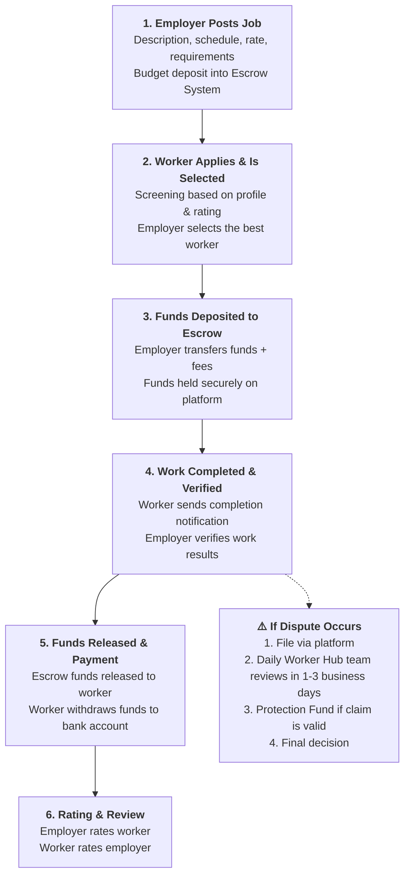

# Daily Worker Hub Platform Features

Daily Worker Hub is built on a foundation of security and trust for the daily workforce ecosystem in Bali. Here are the key features that set us apart from other platforms and protect both parties in every transaction.

---

## Feature Overview

| Feature | Category | Key Benefit |
|---------|----------|-------------|
| **Escrow System** | Payment Security | Salary funds are held by a third party until work is completed |
| **Protection Fund** | Transaction Security | Protection fund to handle disputes and fraud |
| **Find Jobs** | Search | Advanced filters by location, type, rate, schedule |
| **Post Jobs** | Listings | Post with full description and clear requirements |
| **Real-Time Chat** | Communication | Direct communication between workers and employers |
| **Rating & Review** | Reputation | Build reputation for both parties |
| **Top-Up Balance** | Payment | Employers deposit into the Escrow System |
| **Withdraw Funds** | Disbursement | Workers withdraw funds to bank account |

---

## Core Security Features

### Escrow System

The Escrow System holds salary funds with a third party until work is completed and verified by the employer. Workers are guaranteed payment, employers are guaranteed work completion.

**Learn more:** [Escrow System — Complete Documentation](/docs/en/fitur/sistem-dana-jaminan)

### Protection Fund

A platform-managed protection fund to handle disputes or fraud. Funds from this pool can be claimed by the affected party after a review process by the Daily Worker Hub team.

**Learn more:** [Protection Fund — Complete Documentation](/docs/en/fitur/dana-perlindungan)

---

## Operational Features

### Job Search (Workers)

| Feature | Description |
|---------|-------------|
| **Location Filter** | Select areas in Bali: Seminyak, Kuta, Canggu, Ubud, Sanur, Jimbaran, Nusa Dua |
| **Job Type Filter** | F&B, Housekeeping, Receptionist, Driver, Kitchen, Bartender, Special Events |
| **Daily Rate Filter** | Minimum and maximum daily pay range |
| **Schedule Filter** | Weekdays, weekends, or specific dates |
| **Sort** | Nearest, Highest Pay, Newest |
| **Bookmark** | Save interesting listings to apply later |
| **New Job Notifications** | Get alerts when new jobs are posted matching your preferences |

### Job Posting (Employers)

| Feature | Description |
|---------|-------------|
| **Title & Category** | Clear description of the position needed |
| **Task Details** | Complete explanation of tasks and responsibilities |
| **Location & Map** | Address and coordinates for worker reference |
| **Schedule** | Date, check-in time, check-out time, shift duration |
| **Daily Rate** | Pay amount and whether meal/transport is included |
| **Requirements** | Certificates, experience, special skills |
| **Business Photos/Venue** | Visual of workplace to attract workers |
| **Auto-Closing** | Listing auto-closes after applicant quota is met |

### Real-Time Chat

| Feature | Description |
|---------|-------------|
| **Direct Messaging** | Workers and employers can chat without intermediaries |
| **Send Photos/Documents** | Send meeting point photos or additional documents |
| **Typing Indicator** | Know when the other person is typing |
| **Read Receipts** | Confirm messages have been read |
| **Chat History** | All conversations are saved and accessible anytime |

### Rating & Review System

| Feature | Description |
|---------|-------------|
| **1-5 Star Rating** | Employers rate workers after job completion |
| **Written Review** | Text reviews as references |
| **Public Profile Rating** | Rating visible on worker profile for other employers |
| **Employer Rating** | Workers can also rate employers |

---

## Benefits for Each User Type

### Benefits for Workers

| Benefit | Explanation |
|---------|-------------|
| **No Middlemen** | Apply directly to employers without brokers |
| **Guaranteed Payment** | Funds held in Escrow System — no risk of non-payment if work is completed |
| **Full Flexibility** | Choose based on schedule, location, rate, and job type |
| **Dispute Protection** | Protection Fund safeguards you in case of disputes |
| **Build Reputation** | Ratings and reviews increase chances of being accepted for future jobs |
| **Bali Hospitality Community** | Access to a network of major hospitality businesses in Bali |
| **Fast Payout** | After employer approval, funds are immediately credited and can be withdrawn |

### Benefits for Employers

| Benefit | Explanation |
|---------|-------------|
| **Verified Workforce** | All workers have verified identities |
| **Secure Funds** | Deposit in Escrow System until work is completed and satisfactory |
| **Cost Savings** | No commissions for brokers or agencies |
| **Fast Process** | From posting to hiring completed within hours |
| **Dispute Protection** | Protection Fund handles disputes fairly |
| **Rating & Screening** | Reviews from other employers help you select the best workers |
| **Schedule Flexibility** | Hire workers for daily, weekly, or specific project shifts |
| **No Hidden Costs** | All costs are transparent upfront |

---

## Complete Transaction Flow

The following diagram explains how security and platform features integrate within a single transaction:

---

## Why These Features Matter

| Common Problem | Daily Worker Hub Solution |
|----------------|--------------------------|
| Workers not paid after completing work | Escrow System holds funds until verified |
| Dishonest employers refusing to approve payment | Protection Fund handles disputes |
| Brokers taking large commissions | Direct hiring without intermediaries |
| Untrustworthy workers (fake ID) | Mandatory identity verification for all |
| Unknown and untrustworthy employers | Rating & review builds trust |
| Late or unclear payments | Escrow System ensures timely payment |
| Disputes without resolution | Protection Fund + fair review team |

---

## Features Under Development

We continuously improve the platform to provide the best experience. The following features are on our development roadmap:

| Feature | Target | Status |
|---------|--------|--------|
| **Video Interview** | Q3 2026 | In development |
| **Daily Worker Insurance** | Q4 2026 | Planning |
| **Payroll Integration for Employers** | Q4 2026 | Planning |
| **Multi-language Interface** | Q2 2026 | In development |
| **Payout to E-Wallet (OVO, GoPay, Dana)** | Q3 2026 | Planning |

> **Note:** The timeline above is an estimate and may change. We will notify you of any updates via email and app notifications.

---

## Next Steps

| You Want To | Learn About |
|-------------|-------------|
| **Understand the Escrow System in depth** | [Escrow System](/docs/en/fitur/sistem-dana-jaminan) |
| **Understand dispute protection** | [Protection Fund](/docs/en/fitur/dana-perlindungan) |
| **Start finding jobs** | [How to Find Jobs](/docs/en/platform-guide/cara-mencari-lowongan) |
| **Start recruiting workers** | [How to Post Jobs](/docs/en/platform-guide/cara-posting-lowongan) |
| **Understand transaction security** | [Escrow System](/docs/en/fitur/sistem-dana-jaminan) and [Protection Fund](/docs/en/fitur/dana-perlindungan) |
