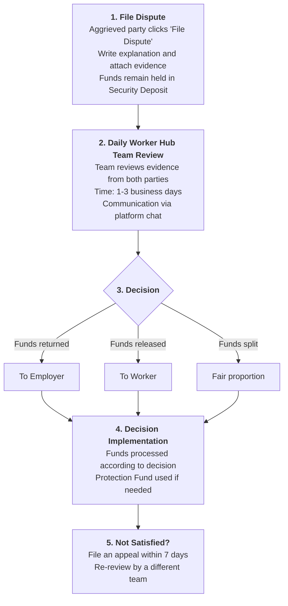

# Security Deposit System

The Security Deposit System is the core of transaction security at Daily Worker Hub. This system ensures that worker salary funds are safe until the work is completed and verified by the employer, while also protecting employers from losses if the work is not completed as agreed.

---

## What is the Security Deposit?

The Security Deposit is a third-party mechanism that holds funds until certain conditions are met. In the context of Daily Worker Hub:

| Party | Role in the Security Deposit |
|-------|--------------------------|
| **Employer** | Deposits salary funds + fees into the Security Deposit before work begins |
| **Worker** | Performs the work, receives funds after the work is verified |
| **Daily Worker Hub** | Manages the Security Deposit as a neutral third party |

> **Note:** Security Deposit funds are stored in an account separate from Daily Worker Hub's operational funds, ensuring that your funds are not commingled with company funds.

---

## How It Works: Step by Step

### Step 1: Employer Deposits Funds

Before work begins, the employer deposits funds into the Security Deposit System:

1. Employer selects a worker and confirms hiring
2. System calculates total deposit: **Daily salary × Number of days + Platform Fee + Security Deposit Service Fee + Protection Fund Contribution + Third-Party Gateway Fee (VA)**
3. Employer makes a transfer via Virtual Account (BCA, BRI, Mandiri) or E-Wallet (GoPay, OVO, Dana)
4. Funds enter the Security Deposit balance and are held until work is completed

| Component | Explanation | Example (Salary Rp 250,000/day × 2 days) |
|----------|-----------|----------------------------------------|
| **Worker Salary** | Agreed pay amount | Rp 500,000 |
| **Platform Fee (3.5%)** | Server operations, support & review team | Rp 17,500 |
| **Security Deposit Service Fee** | Fund handling, audit trail, security | Rp 5,000 (flat) |
| **Protection Fund Contribution (1%)** | Goes to community protection pool | Rp 5,000 |
| **Third-Party Gateway Fee — VA** | Virtual Account fee (third-party) | Rp 4,000 |
| **Total Deposit** | Amount employer must pay | Rp 531,500 |

### Step 2: Worker Performs the Work

After the deposit is successful, the worker receives a notification and performs the work:

1. Worker receives confirmation that funds have been deposited and are safe in the Security Deposit
2. Worker goes to the work location according to the agreed schedule
3. Worker completes the work according to the job listing description
4. Worker sends **"Work Completed"** notification through the platform

### Step 3: Employer Verifies and Approves

Employer verifies that the work meets expectations:

1. Employer checks the work results on site (or via photos/videos for remote work)
2. Employer clicks the **"Verify & Approve Release"** button
3. System processes the confirmation and starts the release countdown

| Verification | Duration | Result |
|-----------|--------|-------|
| **Approved** | 1-3 business days | Funds released to worker's balance |
| **Needs Revision** | Discussion with worker | Worker makes corrections, then re-verify |
| **Dispute** | 3-7 business days | Sent to Daily Worker Hub review team |

> **Tips:** Ideally, employers should verify within 24 hours after the worker submits "Work Completed". Verification delay means payment delay for the worker.

### Step 4: Funds Released to Worker

After the employer approves, funds are released from the Security Deposit:

1. Funds enter the **worker's platform balance** (not directly to bank account)
2. Worker can view the balance in the **"My Balance"** menu
3. Worker performs **"Withdraw"** to disburse to bank account

**Withdrawal Process:**

| Step | Duration | Notes |
|---------|--------|---------|
| Worker clicks "Withdraw" | Immediate | Enter the amount to disburse |
| Withdrawal verification | 1x24 hours | System verifies bank details |
| Funds sent to bank — Regular | 1-3 business days | Rp 2,500 (third-party gateway fee) |
| Funds sent to bank — Instant | ≤ 1 hour | Rp 5,000 (priority option, includes third-party Instant gateway fee) |

| Service | Duration | Fee | Notes |
|---------|--------|-------|---------|
| **Regular Withdrawal** | 1–3 business days | Rp 2,500 | Third-party gateway fee |
| **Instant Withdrawal** | **≤ 1 hour** | **Rp 5,000** | Priority option, includes third-party Instant gateway fee |

> **Warning:** Withdrawals can only be made to a verified bank account in your own name. Accounts under someone else's name will not be accepted by the system.

### Step 5: Rating & Review

After the transaction is complete:
1. Employer gives a rating and review for the worker
2. Worker gives a rating and review for the employer
3. These ratings serve as references for future transactions

---

## Security Features

The Security Deposit System is equipped with multiple layers of security:

### Data Encryption

| Layer | Technology | What It Protects |
|---------|-----------|-----------------|
| **Data in Transit** | TLS 1.3 / SSL | All communication between the app and server |
| **Data at Rest** | AES-256 | Transaction data, balances, and identities stored encrypted |
| **Payment Gateway** | PCI-DSS Compliant | Card data and payment information (via payment gateway) |

### Audit Trail

Every transaction in the Security Deposit System has a complete record:

| Information | Description |
|-----------|-----------|
| **Timestamp** | Exact time of every action (deposit, hold, release, withdraw) |
| **Parties Involved** | Employer ID, Worker ID, Transaction ID |
| **Amount** | Detailed deposit amount, fees, and release |
| **Status** | Current transaction status (pending, held, released, disputed) |
| **IP Address & Device** | Record of the device performing the action |

> **Note:** The audit trail cannot be changed or deleted by anyone, including the Daily Worker Hub team. This record serves as authentic evidence in dispute resolution.

### Two-Factor Verification (2FA)

Sensitive actions in the Security Deposit require additional verification:

| Action | 2FA Required |
|------|---------------|
| **Deposit balance (first time)** | ✅ Yes |
| **Subsequent deposits** | ❌ No (if from the same device) |
| **Release funds (approve)** | ✅ Yes |
| **Withdraw to bank account** | ✅ Yes |
| **Change bank account details** | ✅ Yes |
| **Cancel dispute** | ✅ Yes |

### Fund Segregation

Security Deposit funds are separated from Daily Worker Hub operational funds:

- Security Deposit funds are stored in a dedicated separate account
- Used only for Security Deposit transactions
- Not used for company operational expenses
- Fund segregation is periodically audited by an independent party

---

## Transaction Fee Breakdown

Every transaction on Daily Worker Hub has a **transparent** fee structure.
All fees are displayed to the employer **before** the deposit is made — there are no hidden fees.

| Component | Explanation | Charged To | Example (Salary Rp 500,000) |
|----------|-----------|---------------|--------------------------|
| **Worker Salary** | Agreed pay | — | Rp 500,000 |
| **Platform Fee** | Server operations, support & review team | Employer | Rp 17,500 (3.5%) |
| **Security Deposit Service Fee** | Fund handling, audit trail, transaction security | Employer | Rp 5,000 (flat) |
| **Protection Fund Contribution** | Community protection pool | Employer | Rp 5,000 (1%) |
| **Third-Party Gateway Fee — VA** | Virtual Account BCA/BRI/Mandiri | Employer | Rp 4,000 |
| **Total Employer Deposit** | | | **Rp 531,500** |

> **For comparison:** Traditional broker/agency commissions reach 10–15% of daily salary. With the structure above, **total employer cost is only 6.3%** — and workers still receive 100% of their full salary.

[Learn about the Protection Fund →](/docs/en/fitur/dana-perlindungan)

---

### Third-Party Fees: Payment Gateway

These fees are from **third-party payment providers**, **NOT** Daily Worker Hub revenue. We do not profit from these fees.

| Type | Stage | Amount | Who Pays |
|-------|-------|---------|---------------|
| **Fund Receiving Fee (Virtual Account)** | Employer deposits | Rp 4,000 | Employer |
| **Bank Transfer Fee — Regular (Payout)** | Worker withdraws | Rp 2,500 | Worker |
| **Bank Transfer Fee — Instant (Payout)** | Worker priority withdrawal | Rp 5,000 | Worker |

> **Note:** The third-party gateway fees above are fees according to the terms of the payment provider used. Daily Worker Hub does not add a single rupiah markup.

---

### Complete Calculation Example

| Component | Calculation | Amount | Goes To |
|----------|-------------|--------|----------|
| Worker Salary (Rp 200,000/day × 3 days) | — | Rp 600,000 | Worker |
| Platform Fee (3.5%) | Rp 600,000 × 0.035 | Rp 21,000 | DWH |
| Security Deposit Service Fee (flat) | Flat | Rp 5,000 | DWH |
| Protection Fund Contribution (1%) | Rp 600,000 × 0.01 | Rp 6,000 | Community Pool |
| Third-Party Gateway Fee — VA | Flat | Rp 4,000 | third-party payment provider |
| **Total Employer Deposit** | — | **Rp 636,000** | — |
| | | | |
| **Worker Receives (net)** | — | **Rp 600,000** | Worker |
| Third-Party Gateway Fee — Payout (regular) | Flat | Rp 2,500 | third-party payment provider |
| **Worker Net (after regular withdrawal)** | — | **Rp 597,500** | Worker |

> **Summary:** Of the total Rp 636,000 paid by the employer, Daily Worker Hub only receives **Rp 26,000 (4.1%)** for platform operations and fund handling. The rest: Rp 600,000 to the worker, Rp 6,000 to the community pool, Rp 4,000 to the third-party gateway.

---

## Why This Fee Structure?

We believe transparency is the foundation of trust. Here's how every rupiah is divided in a Rp 500,000 transaction:

| Allocation | Amount | Percentage | Goes To |
|---------|--------|-----------|----------|
| **Worker Salary** | Rp 500,000 | 94% | Worker |
| **Platform Fee** | Rp 17,500 | 3.3% | DWH |
| **Security Deposit Service Fee** | Rp 5,000 | 0.9% | DWH |
| **Community Protection Fund** | Rp 5,000 | 0.9% | Community Pool |
| **Third-Party Gateway Fee (VA)** | Rp 4,000 | 0.8% | third-party payment provider |
| **Total Employer Deposit** | **Rp 531,500** | **100%** | — |

> **For comparison:** Traditional broker commissions reach 10–15% of daily salary. With Daily Worker Hub, workers keep **94% of their full wages**, while employers pay a total of **6.3%** for security, protection, and full transparency.

---

## Transaction Timeline

| Stage | Duration | Responsible Party |
|-------|--------|------------------------|
| **Fund Deposit** | Immediately after successful payment | Employer |
| **Funds Held** | During the work period | System (automatic) |
| **Verification & Approval** | 1-24 hours after worker submits | Employer |
| **Release to Worker Balance** | Immediately after approval | System (automatic) |
| **Withdraw to Bank — Regular** | 1-3 business days | Worker (manual) |
| **Withdraw to Bank — Instant** | ≤ 1 hour | Worker (manual) |
| **Dispute** | Funds remain held until resolved | Review team |

**Total Normal Transaction Estimate:** 3-5 days from deposit to funds entering the worker's bank account (regular), or ≤ 1 hour with Instant Withdrawal.

---

## Dispute Resolution

### When Can a Dispute Be Filed?

| Party | Condition | Reason |
|-------|---------|--------|
| **Worker** | Employer does not approve release after 48 hours even though the work is completed | Payment not disbursed without reason |
| **Worker** | Employer demands corrections outside the scope of the initial agreement | Unauthorized task changes |
| **Employer** | Worker does not complete the work according to the description | Work not as agreed |
| **Employer** | Worker does not show up without confirmation | Worker no-show |
| **Employer** | Work quality is very poor | Results below minimum standards |

### Dispute Process

> **Warning:** Disputes can only be filed within 7 days after the work completion date. After 7 days, the transaction is considered complete and funds are released to the worker.

[Learn more about Dispute Resolution →](/docs/en/fitur/penyelesaian-perselisihan)

---

## Transaction Scenarios: Real-World Examples

### Scenario 1: Normal Transaction

| Step | Detail |
|---------|--------|
| **Post** | Hotel Sari Bali needs 3 waiters for night shift (18:00-24:00), rate Rp 175,000/day |
| **Apply** | 5 workers apply, employer selects 3 best workers based on ratings |
| **Deposit** | Employer deposits: 3 workers × Rp 175,000 + Platform Fee 3.5% + Security Deposit Service Fee + Protection Fund Contribution 1% + VA Fee = Rp 557,625 |
| **Work** | 3 workers arrive on time and complete the shift according to schedule |
| **Verification** | Employer verifies the next day (14 hours after shift) |
| **Release** | Each worker receives Rp 175,000 in platform balance |
| **Withdraw** | All three workers withdraw to their respective accounts (deducted third-party payment provider payout fee of Rp 2,500 regular) |
| **Rating** | Employer gives 5/5 rating, workers give 4/5 rating for employer |

**Result:** Funds reach workers' accounts in 4 days from deposit. Win-win for all.

### Scenario 2: Dispute

| Step | Detail |
|---------|--------|
| **Post** | Restaurant Bali Timur needs 1 chef for a special event |
| **Hire** | Employer selects an experienced chef with a 4.8 rating |
| **Deposit** | Employer deposits: Rp 400,000 + Platform Fee 3.5% + Security Deposit Service Fee + Protection Fund Contribution 1% + VA Fee = Rp 427,000 |
| **Problem** | Chef arrives 2 hours late and does not follow the requested recipe |
| **Dispute** | Employer files a dispute because work quality is not as expected |
| **Review** | Daily Worker Hub team reviews: food photo evidence, recipe agreement chat |
| **Decision** | Funds split: 70% to worker (because work was still completed), 30% refund to employer |
| **Protection Fund** | Employer receives additional compensation from the Protection Fund |

**Result:** Dispute resolved fairly in 3 days. Worker still receives partial salary, employer receives compensation for the delay.

### Scenario 3: Worker No-Show

| Step | Detail |
|---------|--------|
| **Post** | Villa Sunset needs housekeeping for 2 days |
| **Hire** | Employer deposits: Rp 160,000 × 2 days + fees = Rp 343,400 |
| **Problem** | Worker does not show up on the first day without confirmation |
| **Dispute** | Employer files a dispute |
| **Review** | Team verifies: worker did not check-in on the platform, no chat or notification |
| **Decision** | 100% of funds returned to employer. Worker receives a warning. |
| **Protection Fund** | Employer receives compensation from the Protection Fund for handling costs |

**Result:** Employer funds fully returned. Worker given a warning, rating impacted.

---

## Security Deposit System FAQ

**Q: Are my funds truly safe in the Security Deposit?**
A: Yes. Security Deposit funds are stored in a separate account not used for company operations. The system is encrypted with AES-256 and has a complete audit trail.

**Q: How long can funds be held in the Security Deposit?**
A: There is no time limit as long as the transaction is active. However, if there is no activity for 30 days after work is completed, the system will automatically release to the worker unless there is an active dispute.

**Q: What if I (employer) want to cancel before work begins?**
A: You can cancel and funds will be fully returned to your balance, minus a 1% Platform Fee as processing cost. Cancellation must be done before the worker checks in.

**Q: What if I (worker) want to cancel after accepting?**
A: You can cancel, but this will affect your rating. It is recommended to cancel before the employer deposits funds. If canceling after deposit, funds will be returned to the employer in full.

**Q: Can I withdraw partially from my balance, not all of it?**
A: Yes. You can withdraw any amount available in your platform balance, as long as a minimum of Rp 50,000 per transaction.

**Q: Is there a limit on the deposit amount from employers?**
A: There is no upper limit. The minimum deposit is Rp 100,000 per transaction.

**Q: Which banks are supported for withdrawals?**
A: Currently we support BCA, BRI, and Mandiri through third-party gateways. We are developing support for BNI and e-wallets via payment gateways (OVO, GoPay, Dana).

**Q: Why is there a Security Deposit Service Fee?**
A: This fee covers the operational costs of handling your Security Deposit: dispute review team, AES-256 encryption, permanent audit trail, and the audited segregation of Security Deposit accounts. Without this fee, the platform cannot guarantee the security of your funds to current standards.

**Q: Does Daily Worker Hub profit from third-party gateway fees?**
A: **No.** Third-Party Gateway Fees (VA Rp 4,000, Payout Rp 2,500) are third-party fees that we pass through completely without a single rupiah markup.

**Q: Can fees be cheaper?**
A: Yes. For employers with transaction volumes above Rp 10,000,000/month or long-term recurring transactions, please contact our team at support@dailyworkerhub.com for special rate discussions.

**Q: What's the difference between Regular and Instant Withdrawal?**
A: Regular Withdrawal uses the standard bank settlement schedule (1–3 business days) with a Rp 2,500 fee. Instant Withdrawal uses the Instant Withdrawal feature that processes funds within 1 hour with an additional fee of Rp 5,000. The choice is in the worker's hands.

---

## Next Steps

| You Want To | Learn |
|-----------|---------|
| **Understand the Protection Fund** | [Protection Fund](/docs/en/fitur/dana-perlindungan) — how the protection fund works |
| **Deposit balance** | [How to Post Jobs](/docs/en/platform-guide/cara-posting-lowongan) — employer guide |
| **Disburse funds** | [How to Search for Jobs](/docs/en/platform-guide/cara-mencari-lowongan) — worker guide |
| **Summary of all features** | [Features Overview](/docs/en/fitur) |
