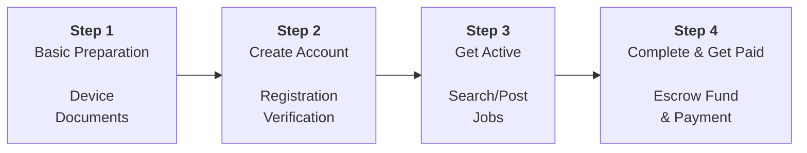

# Getting Started

Welcome to Daily Worker Hub — a daily workforce platform for the Bali hospitality ecosystem. This guide will walk you through every step to get started: from device preparation to completing your first job on the platform.

---

## What is Daily Worker Hub?

Daily Worker Hub is a digital platform that connects **daily workers** with **employers** (hotels, restaurants, villas, cafes, and other hospitality businesses) in Bali. The platform provides:

| Feature | Benefit |
|---------|---------|
| **Escrow Fund System** | Salary funds are held by a third party until the job is completed — a guarantee for both parties |
| **Protection Fund** | Protection funds to handle disputes or fraud |
| **No Middlemen** | Workers and employers communicate directly without additional commission fees from middlemen |
| **Daily Payments** | Workers receive timely payment after the job is completed and verified |
| **Ratings & Reviews** | Reputation built through reviews from both parties |

---

## Journey Map: 4 Steps to Get Started

### Step 1 — Basic Preparation

Prepare the necessary devices and documents before registering. Click [Basic Preparation](/docs/en/getting-started/persiapan-dasar) for full details.

**What you need to prepare:**
- Android 7.0+ or iOS 12.0+ smartphone
- Original ID card (KTP) (required)
- Local bank account: BCA, BRI, or Mandiri (to receive payments)
- Active email and a phone number that can receive SMS

### Step 2 — Create Account

Register and verify your account on the platform. Choose the flow that matches your needs:

| Account Type | Target User | Verification |
|--------------|-------------|--------------|
| [Worker Account](/docs/en/getting-started/membuat-akun#alur-pendaftaran-pekerja) | Daily workers looking for daily jobs | Email + Phone OTP + ID card verification |
| [Employer Account](/docs/en/getting-started/membuat-akun#alur-pendaftaran-pemberi-kerja) | Hospitality businesses needing daily workers | Email + Phone OTP + business verification |

### Step 3 — Get Active on the Platform

**For Workers:** Search for job listings, apply, and wait for employer confirmation. Learn more at [How to Search for Jobs](/docs/en/platform-guide/cara-mencari-lowongan).

**For Employers:** Post job listings, screen applicants, and select suitable workers. Learn more at [How to Post a Job](/docs/en/platform-guide/cara-posting-lowongan).

### Step 4 — Complete the Job & Receive Payment

1. Worker completes the job according to the description
2. Employer verifies and approves fund release
3. Escrow Fund funds are released to the worker's account
4. Worker withdraws funds to a bank account within 1-3 business days
5. Both parties leave a review

---

## Benefits of Using Daily Worker Hub

### For Daily Workers

| Benefit | Explanation |
|---------|-------------|
| **No Middlemen** | Apply directly to employers with no additional fees for middlemen |
| **Guaranteed Payment** | Funds are held in Escrow Fund — no risk of workers not being paid |
| **Flexibility** | Choose your own schedule, location, and type of work |
| **Visibility** | A complete profile increases your chances of being accepted |
| **Protection** | Protection Fund safeguards you in case of disputes |
| **Community** | Access to a large network of hospitality businesses in Bali |

### For Employers

| Benefit | Explanation |
|---------|-------------|
| **Verified Workforce** | All workers have their identity verified |
| **Secure Funds** | Deposit held in Escrow Fund until the job is done |
| **Cost Savings** | No commissions for middlemen or agencies |
| **Fast & Efficient** | The posting-to-hiring process is completed within hours |
| **Protection** | Protection Fund handles disputes fairly |
| **Worker Ratings** | Reviews from other employers help with screening |

---

## Technical Prerequisites

| Requirement | Minimum | Recommended |
|-------------|---------|-------------|
| **Internet Connection** | 3G | 4G/LTE or WiFi |
| **Device** | Android 7.0+ / iOS 12.0+ | Latest OS version |
| **RAM** | 3GB | 4GB+ |
| **Storage** | 500MB free | 1GB+ free |
| **Browser** | Chrome 80+ / Safari 13+ / Firefox 75+ | Latest version |

> **Warning:** Using a browser below the listed minimum versions may cause certain features to not function properly or errors during transactions.

---

## Next Steps

| You Are | Recommended Action |
|---------|-------------------|
| **New worker** | Read [Basic Preparation](/docs/en/getting-started/persiapan-dasar) first |
| **Worker who is ready** | Go directly to [Create Account](/docs/en/getting-started/membuat-akun) |
| **New employer** | Read [How to Post a Job](/docs/en/platform-guide/cara-posting-lowongan) |
| **Already have an account** | Go directly to [Search Jobs](/docs/en/platform-guide/cara-mencari-lowongan) or [Post a Job](/docs/en/platform-guide/cara-posting-lowongan) |

---

## General FAQ

**Q: Is Daily Worker Hub free for workers?**
A: Yes. Registration, job searching, and applying are completely free for workers. The platform takes a small fee from employers on successful transactions.

**Q: Can I have an account as both a worker and an employer at the same time?**
A: Currently, one account can only function as one user type. If you need both functions, use two different devices with two different accounts.

**Q: What if I don't have a bank account yet?**
A: You can still register and use the service. However, fund disbursement requires an active bank account under your own name. We support BCA, BRI, and Mandiri.

**Q: Is Daily Worker Hub available outside of Bali?**
A: Currently, our operational focus is Bali. However, the platform can be accessed from anywhere to view job listings. Jobs posted are located in Bali.

**Q: How is my personal data secured?**
A: Data is encrypted with AES-256, never shared with third parties without consent, and every transaction includes a complete audit trail.
