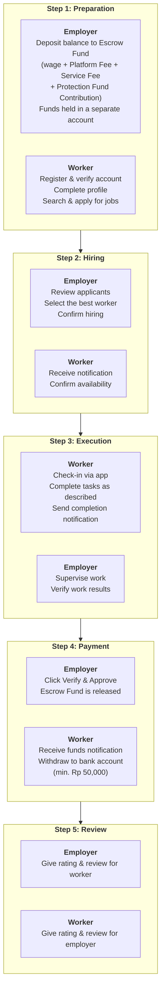

# Daily Worker Hub Documentation

Welcome to the official Daily Worker Hub Documentation Center. This documentation is designed to guide you through every aspect of our platform — from the registration process to dispute resolution. Whether you are a *daily worker* looking for daily jobs in Bali's hospitality sector, or an employer in need of temporary workforce, this guide will help you maximize your experience using our platform.

---

## What Is Daily Worker Hub?

Daily Worker Hub is a **daily workforce marketplace platform** that connects daily workers (*pekerja harian*) directly with hospitality businesses in Bali — no intermediaries, no middlemen, no hidden fees.

| Aspect | Explanation |
|-------|-----------|
| **Platform Type** | Daily workforce marketplace (gig economy) |
| **Sector** | Hospitality (hotels, restaurants, villas, cafes, beach clubs, events) |
| **Model** | Direct hiring — workers and employers connect directly |
| **Location** | Bali, Indonesia (Seminyak, Kuta, Canggu, Ubud, Sanur, Jimbaran, Nusa Dua) |
| **Security System** | Escrow Fund System + Protection Fund |
| **Cost for Workers** | Free (all basic features) |
| **Cost for Employers** | 3.5% Platform Fee + Escrow Fund Service Fee + 1% Protection Fund Contribution per transaction |

### Problems We Solve

| Old Problem | Daily Worker Hub Solution |
|-------------|----------------------|
| Workers not paid after completing work | Escrow Fund holds payment until employer verifies |
| Middlemen taking 10–30% commission | Direct hiring — no intermediaries |
| Unverified workers (fake IDs) | Mandatory identity verification for all accounts |
| Unknown and untrustworthy employers | Ratings & reviews build mutual trust |
| Disputes without fair resolution | Protection Fund + neutral review team |
| Slow recruitment process (days–weeks) | Hiring completed within hours |

---

## Platform Statistics

| Metric | Value | Trend |
|--------|-------|------|
| **Total Registered Workers** | 2,500+ | ↑ 15% this month |
| **Total Employers** | 340+ | ↑ 8% this month |
| **Total Jobs Posted** | 18,000+ | ↑ 12% this month |
| **Successful Transactions** | 96.3% | ↑ from 94.8% |
| **Average Platform Rating** | 4.8/5.0 | Stable |
| **Average Hiring Time** | 4.2 hours | ↓ from 6.1 hours |
| **Average Daily Rate** | Rp 185,000 | — |
| **Coverage Area** | 7 areas in Bali | Seminyak, Kuta, Canggu, Ubud, Sanur, Jimbaran, Nusa Dua |
| **Job Categories** | 9 categories | F&B, Housekeeping, Receptionist, Driver, Kitchen, Bartender, Barista, Chef, Special Events |

---

## Documentation Index

Complete navigation to all guides in this documentation.

### 🚀 Getting Started

Getting started guides to begin your journey on Daily Worker Hub — whether as a worker or employer.

| Page | Description | For |
|---------|-----------|-------|
| [Basic Preparation](/docs/en/getting-started/persiapan-dasar) | Device preparation (smartphone, computer), required documents (ID card, bank account), and platform compatibility | Workers & Employers |
| [Creating an Account](/docs/en/getting-started/membuat-akun) | Complete registration and verification process — separate guides for workers and employers | Workers & Employers |
| [Getting Started Overview](/docs/en/getting-started) | Overview of your first journey on the platform, including benefits and prerequisites | Workers & Employers |

### 👤 For Daily Workers

Complete guides for those seeking daily jobs in Bali's hospitality sector.

| Page | Description |
|---------|-----------|
| [How to Find Jobs](/docs/en/platform-guide/cara-mencari-lowongan) | Step-by-step guide: login, searching with filters, reading job descriptions, applying, handling employer inquiries, understanding application status |
| [Basic Preparation](/docs/en/getting-started/persiapan-dasar) | Device, document, and profile checklist before starting your job search |
| [Protection Fund](/docs/en/fitur/dana-perlindungan) | How you are protected during disputes — coverage, how to claim, timeline |

### 🏢 For Employers

Complete guides for hospitality businesses that need daily workers.

| Page | Description |
|---------|-----------|
| [How to Post a Job](/docs/en/platform-guide/cara-posting-lowongan) | Step-by-step guide: registration, depositing balance, writing compelling job descriptions, selecting applicants, verifying work |
| [Escrow Fund System](/docs/en/fitur/sistem-dana-jaminan) | How deposit funds are securely managed through a third party — step-by-step from deposit to release |
| [Protection Fund](/docs/en/fitur/dana-perlindungan) | How to file a claim in case of a dispute — coverage, claim process, timeline |
| [Platform Guide Overview](/docs/en/platform-guide) | Overview of platform features for employers |

### 🔒 Security Features

In-depth documentation on the two main security systems that protect every transaction.

| Page | Description |
|---------|-----------|
| [Escrow Fund System](/docs/en/fitur/sistem-dana-jaminan) | Escrow Fund payment mechanism: how it works, fee structure, timeline, dispute resolution, real-world scenario examples |
| [Protection Fund](/docs/en/fitur/dana-perlindungan) | Collective protection fund: how funding works, protection coverage, claim process, dispute resolution |
| [Features Overview](/docs/en/fitur) | Summary of all platform features — Free vs Premium comparison, benefits for workers and employers |

### 📖 Additional References

| Reference | Description |
|-----------|-----------|
| [Platform Guide Overview](/docs/en/platform-guide) | Complete overview of how to use the platform for workers and employers |
| [All Job Categories](#job-categories) | See the full list of job categories available on the platform |
| [All Coverage Areas](#coverage-areas) | See the full list of Daily Worker Hub operating areas in Bali |

---

## Job Categories

Daily Worker Hub covers 9 job categories in the hospitality sector:

| Category | Example Positions | Average Rate | Demand |
|----------|--------------|----------------|------------|
| **Waiter/Waitress** | Restaurant server, buffet server, bar runner | Rp 175,000/day | 🔴 High |
| **Kitchen Helper** | Ingredient preparation, washing dishes, plating assistant | Rp 165,000/day | 🔴 High |
| **Housekeeping** | Room cleaning, laundry, common area maintenance | Rp 155,000/day | 🔴 High |
| **Bartender** | Making cocktails & mocktails, bar management | Rp 225,000/day | 🟡 Medium |
| **Barista** | Coffee making, coffee bar management | Rp 200,000/day | 🟡 Medium |
| **Receptionist** | Guest check-in/check-out, answering calls, concierge | Rp 200,000/day | 🟡 Medium |
| **Chef** | Head chef, sous chef, kitchen manager | Rp 300,000/day | 🟢 Low |
| **Driver** | Guest shuttle, shuttle service | Rp 190,000/day | 🟢 Low |
| **Special Events** | Wedding event staff, concerts, corporate events | Rp 200,000/day | 🟡 Medium |

---

## Coverage Areas

Daily Worker Hub currently operates in 7 main areas in Bali:

| Area | Number of Employers | Jobs Posted/Month | Average Rate |
|------|----------------|---------------------|----------------|
| **Seminyak** | 85+ | 350+ | Rp 195,000 |
| **Kuta** | 75+ | 320+ | Rp 180,000 |
| **Canggu** | 65+ | 280+ | Rp 200,000 |
| **Ubud** | 50+ | 220+ | Rp 190,000 |
| **Sanur** | 40+ | 180+ | Rp 175,000 |
| **Jimbaran** | 30+ | 150+ | Rp 200,000 |
| **Nusa Dua** | 25+ | 100+ | Rp 210,000 |

> **Note:** If you need workers in an area not yet covered, please contact our team. We are continuously expanding our operational reach.

---

## Transaction Flow at Daily Worker Hub

Understand how a transaction proceeds from start to finish:

---

## Security and Privacy

Daily Worker Hub uses enterprise-grade security infrastructure to protect every transaction and your personal data:

| Security Feature | Description |
|---------------|-----------|
| **AES-256 Encryption** | All sensitive data (passwords, bank data, identity) is stored encrypted |
| **TLS 1.3** | All communication between app and server is end-to-end encrypted |
| **Two-Factor Authentication (2FA)** | Additional protection on login, fund release, and bank account changes |
| **Complete Audit Trail** | Every transaction is recorded with timestamp, involved parties, and amount — immutable |
| **Fund Segregation** | Escrow Fund assets are stored in separate accounts from operational funds |
| **PCI-DSS Compliant** | International security standards for payment data |
| **Identity Verification** | All users must verify their ID before transacting |
| **Real-Time Monitoring** | System detects and flags suspicious activity automatically |

---

## Additional Resources

### Community

| Resource | Description | Link |
|--------|-----------|------|
| **Daily Worker Hub Blog** | Articles on daily work tips, worker success stories, platform updates | [blog.dailyworkerhub.com](#) |
| **Instagram** | Educational and inspirational content about working in Bali hospitality | [@dailyworkerhub](#) |
| **Telegram Community** | Discussion group for workers and employers | [Join](#) |

### Tools

| Tool | Description |
|------------|-----------|
| **Salary Calculator** | Calculator for estimating total transaction costs (wage + fees) | [Open in Dashboard](#) |
| **Market Rate Guide** | Reference for daily rates by position and area | [View Guide](/docs/en/platform-guide/cara-posting-lowongan#market-rate-reference) |

---

## Frequently Asked Questions (FAQ)

**Q: Is Daily Worker Hub free for workers?**
A: Yes. Registration, job search, applying, chat, and fund withdrawal are free for workers. All transaction fees are borne by employers.

**Q: Can I be both a worker and an employer at the same time?**
A: Currently not available. You need to create two separate accounts with different emails — one as a worker, one as an employer.

**Q: Is this platform only for hotel jobs?**
A: No. In addition to hotels, we also serve restaurants, villas, beach clubs, cafes, coffee shops, event organizers, and other hospitality businesses in Bali.

**Q: How do I know if an employer posting a job is credible?**
A: We provide a rating and review system for employers. Additionally, verified employers receive a "Verified" badge indicating their business identity has been confirmed.

**Q: Is there a written contract or agreement?**
A: The job description posted by the employer and your digital acceptance to apply form a binding agreement. For transactions using the Escrow Fund System, agreement details are stored in the system and can be accessed at any time.

**Q: Can I cancel an application after accepting?**
A: Yes, but this will affect your rating and reputation. It is recommended to only accept offers you are serious about. Excessive cancellations may reduce your chances of being accepted for future jobs.

**Q: What if I want to file a complaint against an employer after the transaction is complete?**
A: You can file a dispute through the "My Transactions" menu within 7 days after the job completion date. Our team will review and provide a decision within 1–7 business days.

---

## Need Help?

If you cannot find answers in this documentation, our support team is ready to assist:

| Channel | Contact | Response Time | Availability |
|---------|--------|---------------|-------------|
| **Email** | [support@dailyworkerhub.com](mailto:support@dailyworkerhub.com) | Within 1x24 business hours | 24/7 |
| **Telegram** | [@DailyWorkerHubSupport](https://t.me/DailyWorkerHubSupport) | 1–4 hours | 08:00–18:00 WIB |
| **WhatsApp** | +62 812-XXXX-XXXX | 1–4 hours | 08:00–18:00 WIB |

> **Note:** Response times may be longer on national holidays and outside business hours (18:00–08:00 WIB). For urgent Escrow Fund issues or disputes, use email with the subject "URGENT — Escrow Fund Issue".
